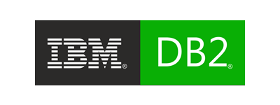

# DB2

Imagen con un db2 configurado

## ACCESOS

* **user**: sa
* **pass**: Leafnoise-1234
* **puerto**: 50000
* **base**: testdb

## VOLUMES

* **database**: con los datos guardados de la base de datos

## VARIOS

Se incluye los drivers de java descargados de la pagina de db2 para conectarse, para los proyectos 
java o las GUI se usa el driver llamado **db2jcc4.jar**