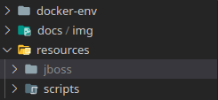

# JBOSS EAP 7.1

> Imagen de openjdk:8-alpine con un jboss eap 7.1

## REQUISITOS

* docker
* docker-compose
* network con el nombre de *phantom-network*, para crearla ejecutar: `docker network create phantom-network`

## EJECUCION

* Parado en el directorio raiz del repo ejecutar: `docker-compose up -d`

## PUERTOS

* **consola**: 9990
* **debug**: 7080

* **puertos expuestos para despliegues**: del 8080 al 8180

## ACCESOS CONSOLA

* **user**: leafnoise
* **pass**: leafnoise

## VOLUMES

Se crea un volume automaticamente con el nombre de *jboss_volume-jboss-eap-7.1* que tiene el contenido del Jboss

## CONFIGURACION

en el archivo ubicado en **docker-env/jboss.env** se encuentras las variables de ambiente para configurar el compose

## SCRIPTS

Se tienen que correr desde la raiz del proyecto, ejemplo:
`./scripts/docker/build.sh`

## ACTUALIZAR VERSION DE LA IMAGEN

En caso querer generar una nueva version de esta imagen se deben seguir los siguientes pasos:

**IMPORTANTE**
En caso de querer crear la imagen con otro tag se debe modificar el script `./scripts/docker/ambiente.sh`, por default el valor de la *VERSION* es *latest*, por lo que si se efectuan todos estos pasos sin cambiar la version, la nueva version generada pisará a la anterior

* Como es requerido un *Jboss* para contruirla hay que descargar una version de jboss-eap de la pagina de Redhab
* Una vez descargado el *.zip* del Jboss, descomprimirlo
* Mover la carpeta generada del .zip dentro de la carpeta *resources* y cambiarle el nombre a *jboss* quedando de la siguiente forma: 

* Ahora sí es posible construir la imagen ejecutando el script `./scripts/docker/build.sh`
* Para sibirla al repo ejecutar el script `./scripts/docker/push.sh`

## PAGINAS

[openjdk docker hub](https://hub.docker.com/_/openjdk?tab=description)
[jboss eap](https://developers.redhat.com/products/eap/download)
